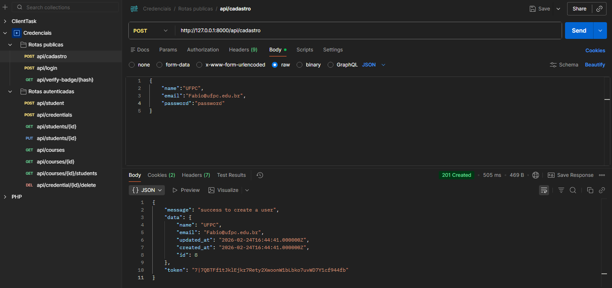
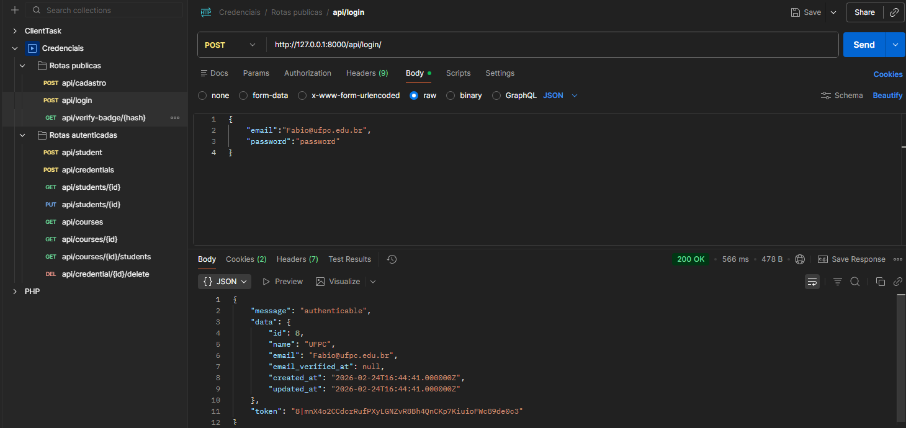
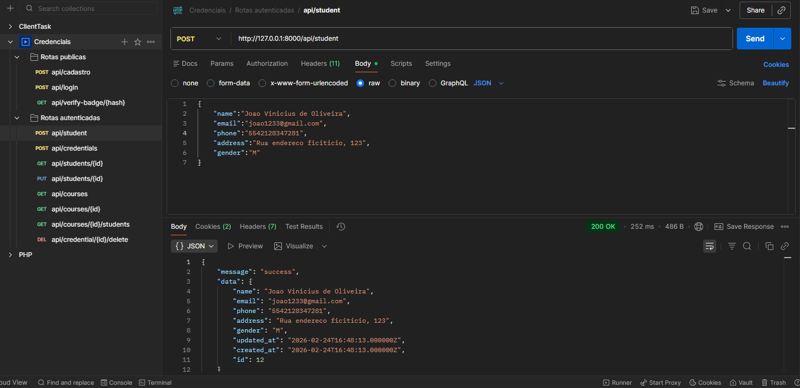
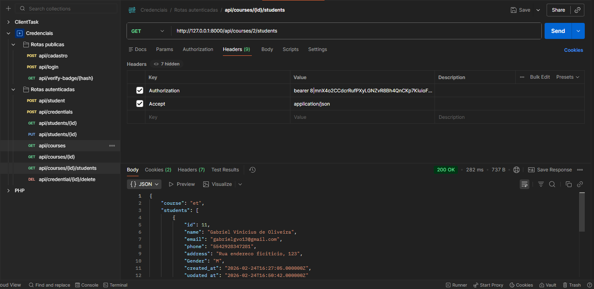
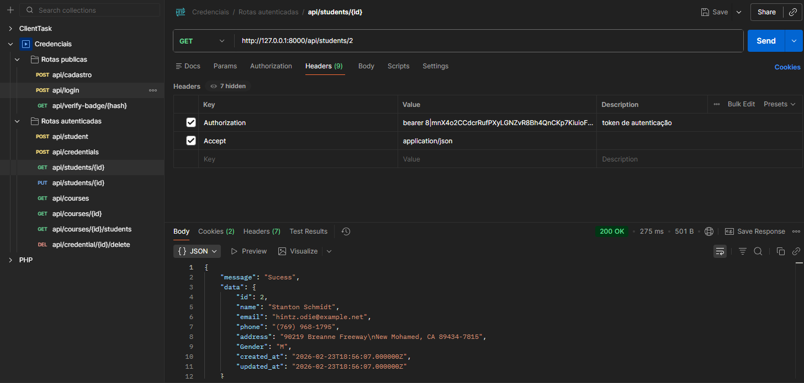
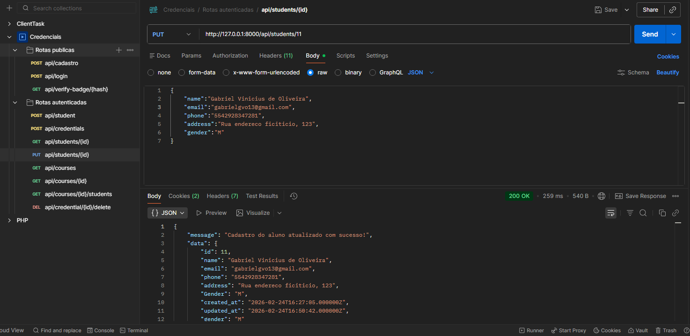
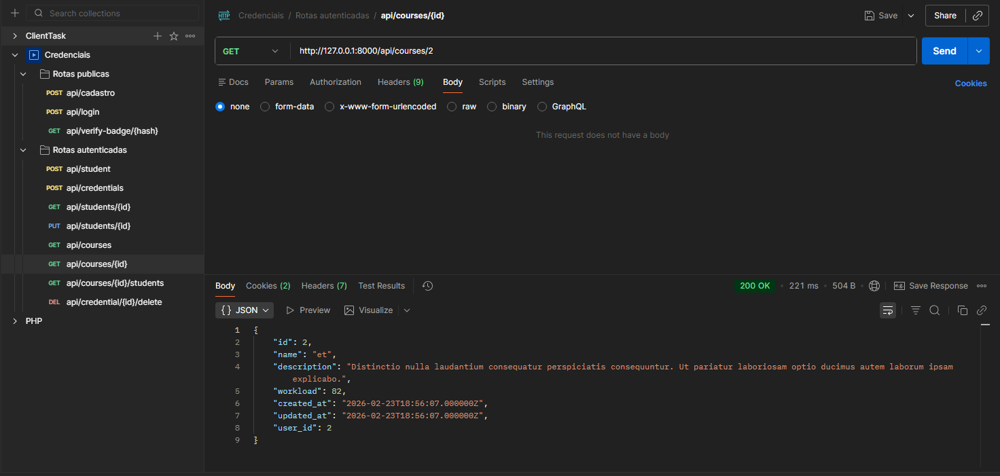
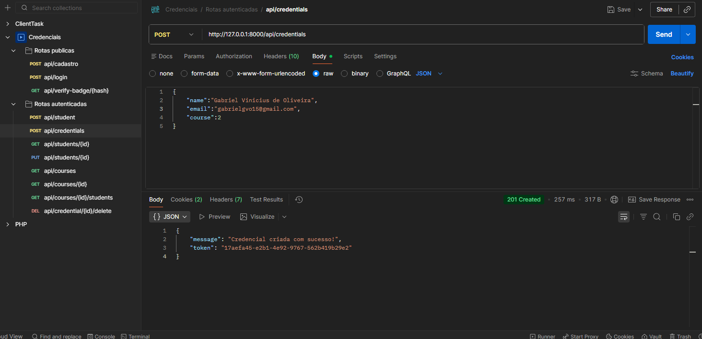
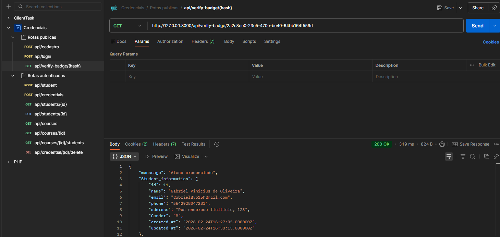
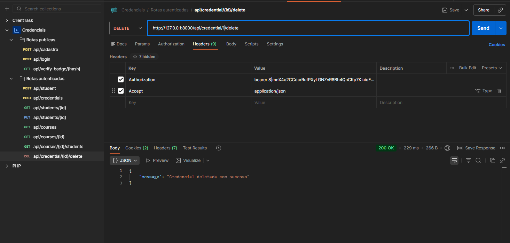

# Microcredenciais API

API RESTful desenvolvida em Laravel para o gerenciamento de estudantes, cursos e emissão de microcredenciais. O sistema utiliza o Laravel Sanctum para autenticação segura de rotas através de tokens.

---

## Estrutura do Banco de Dados

Baseado nas migrations e modelos do projeto, o sistema possui as seguintes entidades principais:

### Users
Gerenciamento de usuários e autenticação da API.
- nome
- email
- password

### Students
Armazena os dados dos estudantes:
- nome
- email
- phone
- address
- gender

### Courses
Armazena os cursos oferecidos pelas instituições:
- name
- description
- workload
- user_id

### Credentials
Armazena os vínculos entre alunos e cursos (as microcredenciais emitidas):
- student_id
- course_id
- user_id
- token

---

## Rotas da API

### Rotas Públicas
- `POST /api/cadastro`: Criação de uma nova conta de usuário/instituição.
- `POST /api/login`: Autenticação e geração do token de acesso.
- `GET /api/verify-badge/{hash}`: Verificação pública da autenticidade de um badge.

### Rotas Autenticadas (Sanctum)
Requerem o envio do Token no header `Authorization: Bearer {token}`.

**Usuário Autenticado:**
- `GET /api/user`: Retorna os dados do usuário/instituição logado.

**Estudantes:**
- `POST /api/student`: Cadastra um novo estudante.
- `GET /api/students/{id}`: Exibe os dados de um estudante específico.
- `PUT /api/students/{id}`: Atualiza os dados de um estudante.

**Cursos:**
- `GET /api/courses`: Lista todos os cursos.
- `GET /api/courses/{id}`: Exibe os detalhes de um curso.
- `GET /api/courses/{id}/students`: Lista os estudantes que possuem credencial neste curso.

**Credenciais:**
- `POST /api/credentials`: Emite uma nova credencial (badge) vinculando um estudante a um curso.
- `DELETE /api/credentials/{id}`: Remove uma credencial existente.

---

## Testes e Telas de Funcionamento (Postman)

Abaixo estão os testes realizados em cada endpoint da API, demonstrando o fluxo completo de funcionamento do sistema:

### 1. Autenticação e Cadastro
Cadastro de uma nova instituição de ensino e geração do token de login.
- **Cadastro:**

- **Login:**

### 2. Gerenciamento de Estudantes
Operações de CRUD para os alunos do ecossistema.
- **Adicionar Estudante:**

- **Listar Estudantes:**

- **Retornar Estudante Específico:**

- **Atualizar Estudante:**

### 3. Gerenciamento de Cursos
- **Detalhes do Curso:**

### 4. Emissão e Verificação de Credenciais
Fluxo de geração de badges e validação pública através do Hash único.
- **Conceder Credencial (Badge):**

- **Verificar Badge (Rota Pública):**

- **Deletar Credencial:**
